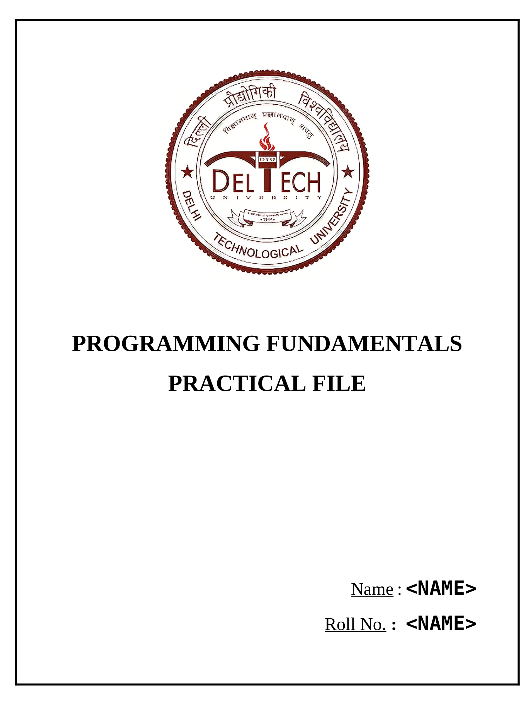

# basic-C-programs

## Programs

All the **[programs](./program_files/)** **I** made for my `Programming Fundamentals` Course
> **All the programs are in C Language**

## Template Files
Template Files for __Record File__ :
- [Home Page](./template_files/home_page.docx)
- [Index Page](./template_files/index_page.docx)
- [Program Page](./template_files/program_page.docx)
 
#### Home Page

#### Index Page

#### Program Page

